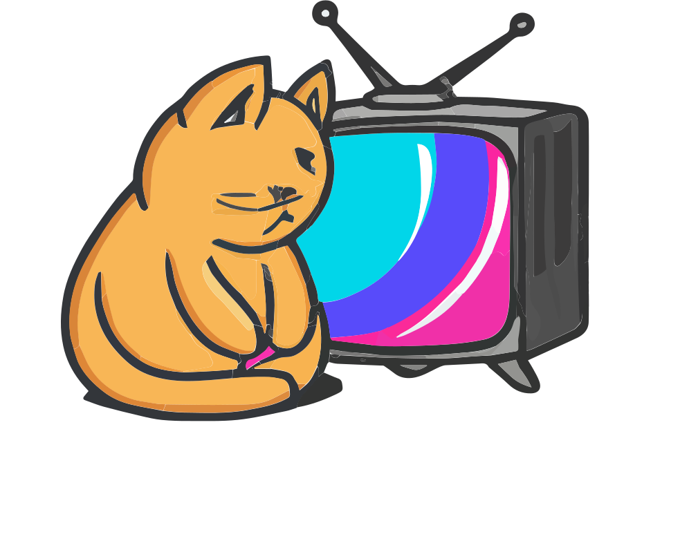

<h1 align="center">
   
  
   
</h1>

- [Features](#features)
- [Libs and Frameworks](#libs)
- [Developers](#devs)

## 🐱 Features:
* Login/Sign Up
* Search cartoons
* Add to watchlist
* Delete from watchlist
* Add a review
* Favorite show

## 🐱 Languages, Libraries and Frameworks
* MongoDB
* React JS
* React Native
* Express JS
* Tailwind CSS
* Nodemailer

## 🐱 Developers
* Nicole Nascimento
* Cay Henning
* Mike Burke
* Evangelos Kontonotas
* Feifan Cao
